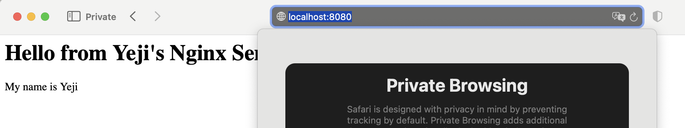

# **프로젝트 개요** 
Terminal, Docker, Git/GitHub을 활용하여 어디서든 동일하게 작동하는 재현 가능한 AI/SW 개발 워크스테이션을 구축을 목표로 한다. Terminal을 통해 작업 디렉토리 체계와 보완 권한을 설정하고, Docker를 이용해 독립된 컨테이너 환경을 실행 및 관리한다. Dockerfile로  웹 서버를 컨테이너화고, 포트 매핑을 통한 서비스 접속, 바인드 마운트를 이용한 실시간 변경 사항 반영, 그리고 Docker 볼륨을 통한 데이터 영속성 유지를 검증한다.

# 1. 실행 환경

- OS: MacOS 15.7.4
- Shell: zsh 5.9
- terminal: VS Code Intergrated Terminal (1.112.0)
- Docker: 28.5.2
- Git: 2.53

# 2. 수행 체크리스트

- [X] 터미널 기본 조작 및 폴더 구성
- [X] 권한 변경 실습
- [X] Docker 설치/점검
- [X] hello-world 실행
- [X] Dockerfile 빌드/실행
- [X] 포트 매핑 접속
- [X] 바인드 마운트 반영
- [X] 볼륨 영속성
- [X] Git 설정 + VSCode GitHub 연동

# 3. 터미널 조작 로그 기록

## (1) 현재 위치 확인
```bash
$ pwd
/Users/byjol4324/Desktop
```
## (2) 목록 확인(숨김 파일 포함)
```bash
$ ls -la
total 16
drwx------+  4 byjol4324  byjol4324   128 Apr  4 15:18 .
drwxr-x---+ 20 byjol4324  byjol4324   640 Apr  4 15:19 ..
-rw-r--r--@  1 byjol4324  byjol4324  6148 Apr  4 15:18 .DS_Store
-rw-r--r--   1 byjol4324  byjol4324     0 Apr  4 15:18 README.md
```

## (3) 폴더 생성 및 이동
```bash
$ mkdir yejibaek 
$ cd yejibaek
```

## (4) 빈 파일 생성 및 파일 내용 확인
```bash
$ touch 01_yeji.md
$ cat 01_yeji.md
```

## (5) 파일 복사
```bash
$ cp 01_yeji.md 02_yeji.md
```

## (6) 이름 변경 및 파일 위치 이동
```bash
$ mv 02_yeji.md 02_yeji_d.md
$ mv 02_yeji_d.md ~/Desktop
```
## (7) 파일 삭제
```bash
$ rm 02_yeji_d.md
```
## (8) 위치 이동 
```bash
# 절대 경로를 이용해 배경화면으로 이동
$ cd ~/Desktop
# 상대 경로를 이용해 상위 폴더로 이동 
$ cd ..
```
### 💡 **절대경로 / 상대경로 구분**
> 
> | 구분 | 절대경로 | 싱대경로 |
> | :--- | :--- | :--- |
> | 작성 방식 | 전체 주소 | 현재 작업 중인 파일의 위치 기준 |
> | 예시 | C:\Users\Documents\test.py | `.` : 현재 내가 있는 폴더 <br> ./images/logo.png <br><br> `..` : 바로 위의 상위 폴더 <br> ../index.html |
> | 이식성 | 낮음(내 컴퓨터에서만 작동) | 높음(다른 사람의 컴퓨터에서도 작동) |
> | 사용 예시 | 프로젝트 내부 파일 연결| 외부 리소스(URL 등) 연결

<br>

# 4. 권한 변경 실습
## (1) 파일 권한 체계 분석
### 1. 권한 기호 의미
| 권한 기호 | 의미 | 숫자 값 |
| :---: | :--- | :---: |
| **r** | 읽기 (Read) | **4** |
| **w** | 쓰기 (Write) | **2** |
| **x** | 실행 (Execute) | **1** |
### 2. 자릿수 순서의 의미
| 자릿수 | 대상 | 해석 예시 (755) |
| :---: | :---: | :--- |
| **첫 번째** | **소유자 (나)** | **7** (4+2+1): 모든 권한 허용 |
| **두 번째** | **그룹 (팀원)** | **5** (4+0+1): 읽기 및 실행만 허용 |
| **세 번째** | **기타 (나머지)** | **5** (4+0+1): 읽기 및 실행만 허용 |

## (2)  파일 권한 변경 실습
### 1. 파일 생성 및 초기 권한 확인
```bash
$ touch test_file.txt
$ ls -l test_file.txt
-rw-r--r--  1 byjol4324  byjol4324  0 Apr  4 15:56 test_file.txt
```
### 2. 권한 변경 및 권한 확인
```bash
$ chmod 777 test_file.txt
$ ls -l test_file.txt
-rwxrwxrwx  1 byjol4324  byjol4324  0 Apr  4 15:56 test_file.txt
```

## (3) 디렉토리 권한 변경 실습
### 1. 디렉토리 생성 및 초기 권한 확인
```bash
$ mkdir yejibaek
$ ls -ld yejibaek
drwxr-xr-x  4 byjol4324  byjol4324  128 Apr  4 15:56 yejibaek
```
### 2. 권한 변경 및 권한 확인
```bash
$ chmod 700 yejibaek
$ ls -ld
drwx------+ 5 byjol4324  byjol4324  160 Apr  4 15:37 .
```

### 💡 **ls 명령어 옵션 정리**
> | 명령어 | 설명 | 주요 용도 |
> | :-- | :-- | :-- |
> ls -l | 현재 파일/폴더의 상세 정보 | 권한, 용량, 수정 날짜 등 확인 |
> ls -ld |현재 디렉토리 자체의 정보 | 지금 내가 있는 폴더의 권한 확인 |
> ls -la | 숨김 파일을 포함한 상세 정보 | 권한, 소유자, 크기, 날짜, 파일명 등 |
> ls -a | 숨김 파일을 포함한 모든 파일 | 파일명 및 숨김 파일명만 빠르게 확인 |

<br>

# 5. 컨테이너 실행 실습
## (1) Docker 설치 및 상태 점검
### 1. 버전 확인
```bash
$ docker --version
Docker version 28.5.2, build ecc6942
```
### 2. Docker 데몬 동작 여부 확인
```bash
$ docker info
Version: 28.5.2
Containers: 6 
Operating System: OrbStack
<중략>
```

## (2) Docker 이미지 및 컨테이너 조작
### 💡 용어 정리
> | 용어 | 정의 | 비유 |
> | :--- | :--- | :--- |
> | **Linux** | 모든 시스템이 돌아가는 기본 바닥 | 요리를 할 수 있는 주방 |
> | **Ubuntu** | 사리눅스 주방에서 가장 즐겨 쓰는 환경 세팅 | 한식 전용 주방 세팅 |
> | **Docker** | 프로그램들을 독립된 상자에 담아 실행하는 시스템 | 도시락 배달 서비스(음식이 섞이지 않게 상자에 담아 관리) |
> | **Dockerfile** | 이미지를 어떻게 만들지 적어둔 메모장 | 도시락 주문서/레시피(재료와 조리법이 적힌 종이) |
> | **Images** | 실행만 하면 바로 프로그램이 나오는 저장 상태 | 냉동 밀키트(뜯어서 데우기만 하면 됨) |
> | **Container** | 이미지를 실제로 실행해서 쓰고 있는 상태 | 실제로 손님 앞에 놓여서 먹을 수 있는 상태 |


### 1. 이미지 다운로드 및 목록 확인
```bash
$ docker pull hello-world 
$ docker images
REPOSITORY    TAG       IMAGE ID       CREATED       SIZE
hello-world   latest    e2ac70e7319a   11 days ago   10.1kB
```
### 2. 컨테이너 실행 
```bash
$ docker run --name my-hello-world hello-world
Hello from Docker!
This message shows that your installation appears to be working correctly.
```
### 3. 실행 목록 확인
```bash
$ docker ps -a
CONTAINER ID   IMAGE         COMMAND    CREATED         STATUS                     PORTS     NAMES
0745191144d5   hello-world   "/hello"   7 seconds ago   Exited (0) 5 seconds ago             my-hello-world
```

## (3) Docker 운영 및 리소스 확인
### 1. 컨테이너 로그 확인 
```bash
$ docker logs my-hello-world
Hello from Docker!
This message shows that your installation appears to be working correctly.
```
### 2. 리소스 사용량 확인
```bash
$ docker stats --no-stream
CONTAINER ID   NAME      CPU %     MEM USAGE / LIMIT   MEM %     NET I/O   BLOCK I/O   PIDS
```

## (4) Ubuntu 컨테이너 실행 
### 1. 우분투 생성 및 확인
```bash
$ docker run -it --name my-ubuntu ubuntu /bin/bash
Unable to find image 'ubuntu:latest' locally
latest: Pulling from library/ubuntu
817807f3c64e: Pull complete 
Digest: sha256:186072bba1b2f436cbb91ef2567abca677337cfc786c86e107d25b7072feef0c
Status: Downloaded newer image for ubuntu:lates
root@c62fc68e0a62:/# 

$ ls
bin  boot  dev  etc  home  lib  lib64  media  mnt  opt  proc  root  run  sbin  srv  sys  tmp  usr  var

$ echo "test success"
test success
```

### 2. 컨테이너 종료 및 확인
```bash
$ exit
byjol4324@c4r6s7 Desktop % 

$ docker ps -a
CONTAINER ID   IMAGE         COMMAND       CREATED          STATUS                      PORTS     NAMES
c62fc68e0a62   ubuntu        "/bin/bash"   12 minutes ago   Exited (0) 2 seconds ago              my-ubuntu
0745191144d5   hello-world   "/hello"      29 minutes ago   Exited (0) 29 minutes ago             my-hello-world
```
### 3. 컨테이너 유지 및 확인
#### ① 컨테이너 재실행
```bash
$ docker start my-ubuntu
```
#### ② 컨테이너 진입
```bash
$ docker exec -it my-ubuntu /bin/bash
```
#### ③ 종료 및 확인
```bash
$ exit

$ docker ps -a
CONTAINER ID   IMAGE         COMMAND       CREATED          STATUS                      PORTS     NAMES
c62fc68e0a62   ubuntu        "/bin/bash"   20 minutes ago   Up 3 minutes                          my-ubuntu
0745191144d5   hello-world   "/hello"      37 minutes ago   Exited (0) 37 minutes ago             my-hello-world
````
# 6. 기존 Dockerfile 기반 커스텀 이미지 제작
## (1) 베이스 이미지
```bash 
FROM ubuntu:22.04
```
## (2) 커스텀 포인트
### 1. Nginx, Curl 설치
```bash
$ apt-get update
$ apt-get install -y nginx
$ service nginx start
  * Starting nginx nginx

$ apt-get install -y curl
$ curl localhost
<title>Welcome to nginx!</title>
```
> - Nginx(웹 서버): 컨테이너 내부에 있는 웹 페이지를 외부 사용자가 브라우저를 통해 볼 수 있도록 중간에서 연결하고 전달하는 역할
> - Curl(네트워크 확인 도구): 설치된 웹 서버가 컨테이너 내부에서 정상적으로 작동하고 있는지 확인하기 위한 테스트 도구

### 2. 환경 변수로 이름 등록
```bash
ENV MY_NAME="Yeji"
```
> **환경 변수(ENV) 설정 이유**
> - 목적 : 컨테이너가 기억해야 할 정보를 미리 등록하기 위함.
> - 활용: 웹사이트 소스코드를 일일이 수정하지 않고, 이 설정값만 변경해서 문구를 한번에 변경 가능.

### 3. Nginx가 보여줄 기본 페이지 수정
```bash
RUN echo "<h1>Hello from Yeji's Nginx Server!</h1><p>My name is $MY_NAME</p>" > /var/www/html/index.html
```
> h1: 큰 제목 글씨체 <br>
> p: 일반 본문 글씨체 <br>
> /var/www/html/index.html: 이 경로에 해당 내용을 저장

## (3) 빌드 
```bash
$ docker build -t my-nginx-ubuntu .
[+] Building 31.2s (7/7) FINISHED                                                                                                  docker:orbstack
 => [internal] load build definition from dockerfile                                                                                          0.1s
 => => transferring dockerfile: 601B                                                                                                          0.0s
 => [internal] load metadata for docker.io/library/ubuntu:22.04                                                                               0.0s
 => [internal] load .dockerignore                                                                                                             0.1s
 => => transferring context: 2B                                                                                                               0.0s
 => CACHED [1/3] FROM docker.io/library/ubuntu:22.04                                                                                          0.0s
 => [2/3] RUN apt-get update && apt-get install -y nginx curl                                                                                29.4s
 => [3/3] RUN echo "<h1>Hello from Yeji's Nginx Server!</h1><p>My name is Yeji</p>" > /var/www/html/index.html                                0.5s 
 => exporting to image                                                                                                                        0.8s 
 => => exporting layers                                                                                                                       0.7s 
 => => writing image sha256:39b9298cc07020c6901f6d43367be0eadde0400866dc2a6ceff76f255255f5c3                                                  0.0s 
 => => naming to docker.io/library/my-nginx-ubuntu                                              
```

## (4) 실행 및 커스텀 확인 결과 
```bash
$ docker run -d -p 8080:80 --name yeji-web my-nginx-ubuntu 

$ docker exec yeji-web echo $MY_NAME
Yeji

$ curl http://localhost:8080
<h1>Hello from Yeji's Nginx Server!</h1><p>My name is Yeji</p>
```

# 7. 포트 매핑
## (1) 컨테이너 생성 및 포트 연결
```bash
$ docker run -it -p 8080:80 --name yeji-web my-nginx-ubuntu
```

## (2) 컨테이너 실행
```bash
$ docker run -d -p 8080:80 --name yeji-web my-nginx-ubuntu
```

## (3) 최종 결과 확인
- **접속 주소:** http://localhost:8080



# 8. Docker 볼륨 영속성 검증
## (1) 볼륨 생성 및 컨테이너 연결
```bash
$ docker volume create my-db-data
my-db-data

$ docker run -it --name test-container -v my-db-data:/app/data ubuntu:22.04
root@f08ed0da11d7:/# 
```
## (2) 데이터 생성 및 컨테이너 삭제
### 1. 컨테이너 내부의 연결된 폴더에 테스트 파일 생성
```bash
$ cd /app/data
$ echo "This data is persistent!" > persistence_test.txt
$ ls
persistence_test.txt
$ exit
```
### 2. 컨테이너 삭제
```bash
$ docker rm test-container
test-container
```
## (3) 데이터 유지 검증 (새 컨테이너 연결)
### 1. 새로운 컨테이너를 동일한 볼륨에 연결하여 실행
```bash
$ docker run -it --name test-recovery -v my-db-data:/app/data ubuntu:22.04
root@e584d9456a63:/# 
```
### 2. 데이터 확인
```bash
$ cat /app/data/persistence_test.txt
This data is persistent!
```
# 9. Git 설정 및 GitHub 연동
## (1) Git 사용자 정보 설정
### 1. 사용자 이름 밒 이메일 설정
```bash
$ git config --global user.name "yejibaek12"
$ git config --global user.email "byjol@naver.com"
```
### 2. 설정 결과 확인
```bash
$ git config --list | grep user
user.name=yejibaek12
user.email=byjol@naver.com
```
## (2) 로컬 저장소 초기화 및 커밋 
### 1. 현재 폴더를 Git 저장소로 초기화
```bash
$ git init
```
### 2. 기본 브랜치 이름을 main으로 변경
```bash
$ git config --global init.defaultBranch main
```
### 3. 모든 파일 스테이징
```bash
$ git add .
```

### 4. 커밋 생성
```bash
$ git commit -m "Add Docker volume test results"
```
## (3) GitHub 원격 저장소 연동 (최초 연결)
### 1. GitHub 원격 저장소 주소 등록
```bash
$ git remote add origin https://github.com/yejibaek12/260404.git
```
### 2. 연동 상태 확인
```bash
$ git remote -v
origin  https://github.com/yejibaek12/260404.git (fetch)
origin  https://github.com/yejibaek12/260404.git (push)
```
## (4) GitHub로 파일 업로드
```bash
$ git push -u origin master
# 최초 실행 시에만 -u 옵션을 사용하여 원격 브랜치와 연결
# 이후부터는 간단히 git push 만으로 업로드 가능
```